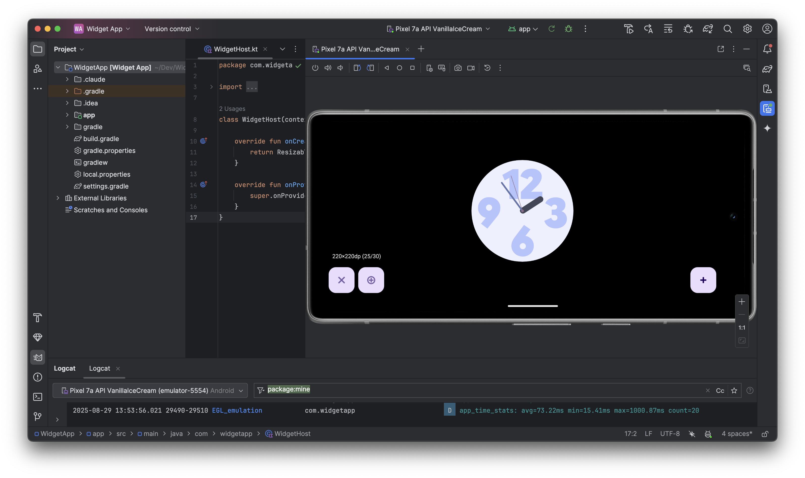

# WidgetApp

An Android application for hosting and testing widgets with resizable functionality and full landscape support.

## Features

- **Widget Picker**: Browse and select from all available widgets on the device
- **Resizable Widgets**: Interactive controls to resize widgets and test different dimensions
- **Landscape Support**: Widgets persist when rotating between portrait and landscape orientations
- **Size Information**: Real-time display of current widget dimensions and available sizes
- **Custom Widget Host**: Handles widget lifecycle and binding permissions

## Screenshots



*Widget App running in the Android Studio emulator with a clock widget loaded. Shows the resize controls (-/+) and size information (220x220dp) at the bottom.*

## Requirements

- Android API 21+ (Android 5.0 Lollipop)
- Device with installed widgets to test

## Installation

1. Clone the repository:
   ```bash
   git clone https://github.com/YOUR_USERNAME/WidgetApp.git
   cd WidgetApp
   ```

2. Open in Android Studio

3. Build and run on your device or emulator

## Usage

1. **Add Widget**: Tap the floating action button (+) to open the widget picker
2. **Select Widget**: Choose any widget from the categorized list
3. **Resize Widget**: Use the size controls (+ / -) to test different widget dimensions
4. **View Size Info**: Current widget size and available sizes are displayed at the bottom
5. **Test Orientation**: Rotate your device - the widget will persist across orientation changes

## Architecture

### Key Components

- **MainActivity**: Main activity with widget container and controls
- **WidgetPickerActivity**: Displays available widgets grouped by app
- **ResizableAppWidgetHostView**: Custom widget host view with resize capabilities
- **WidgetHost**: Custom AppWidgetHost for managing widget lifecycle
- **GroupedWidgetAdapter**: RecyclerView adapter for organized widget display

### Configuration Changes

The app handles orientation changes without recreating the activity by using:
- `android:configChanges="orientation|screenSize|screenLayout|keyboardHidden"`
- Custom `onConfigurationChanged()` implementation

## Permissions

The app requires the following permissions:
- `BIND_APPWIDGET`: Required to bind and host widgets
- `QUERY_ALL_PACKAGES`: Needed to discover available widgets
- `GET_TASKS`: For widget management

## Building

```bash
./gradlew assembleDebug
```

The APK will be generated at:
`app/build/intermediates/apk/debug/app-debug.apk`

## Contributing

1. Fork the repository
2. Create a feature branch (`git checkout -b feature/amazing-feature`)
3. Commit your changes (`git commit -m 'Add amazing feature'`)
4. Push to the branch (`git push origin feature/amazing-feature`)
5. Open a Pull Request

## License

This project is open source and available under the [MIT License](LICENSE).

## Technical Notes

### Widget Sizing
- Widgets are sized based on their declared minimum and resize dimensions
- The app provides common Android widget sizes (1x1, 2x2, 3x2, etc.)
- Real-time size reporting in both pixels and density-independent pixels (dp)

### Landscape Support
- Activity lifecycle is preserved during orientation changes
- Widgets automatically refresh and adapt to new screen dimensions
- No widget state is lost during rotation

---

*Built for testing and development of Android widget functionality*